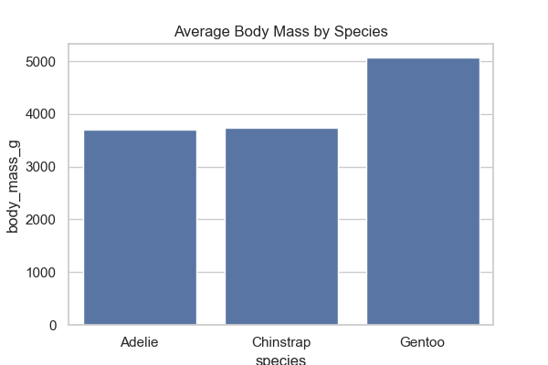
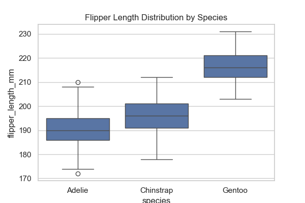
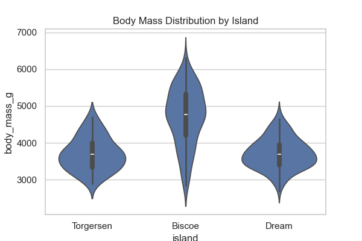
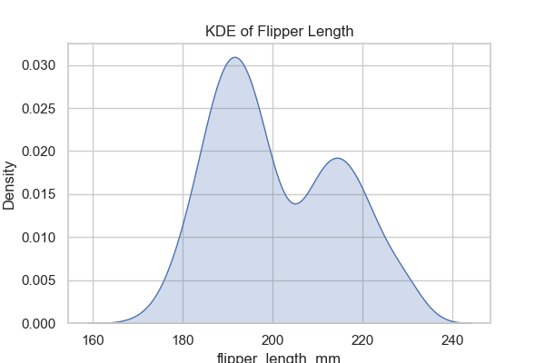
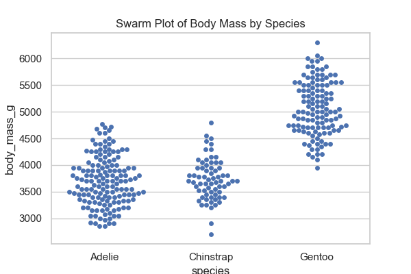
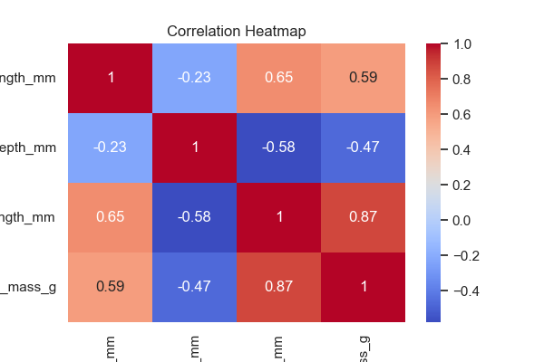
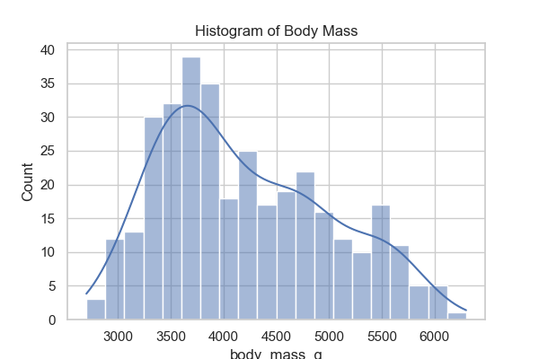
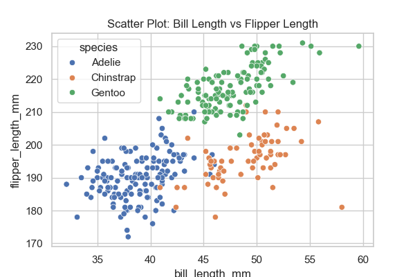
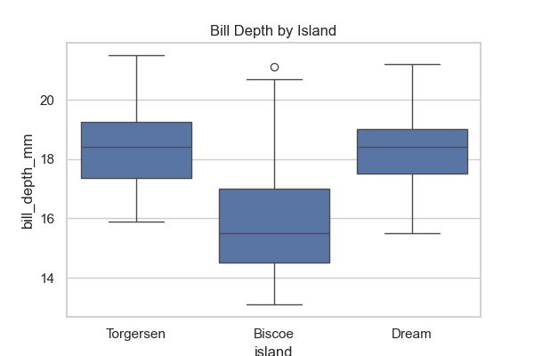

# 🐧 Palmer Penguins EDA (Seaborn + Matplotlib)

## 📊 Dataset
The **Palmer Penguins** dataset contains measurements for penguins observed in the Palmer Archipelago, Antarctica.  

**Features include:**
- Species (Adelie, Chinstrap, Gentoo)  
- Island (Biscoe, Dream, Torgersen)  
- Bill length (mm)  
- Bill depth (mm)  
- Flipper length (mm)  
- Body mass (g)  
- Sex (male/female)  
- Year of observation  

👉 Original dataset is available on Kaggle: *Palmer Penguins Dataset*.  
👉 Also available via Seaborn with `sns.load_dataset("penguins")`.

---

## 📈 Visualizations & Insights

### 1. Average body mass by species
  
🔎 Gentoo penguins are the heaviest, followed by Adelie and Chinstrap.

---

### 2. Flipper length distribution by species
  
🔎 Gentoo penguins clearly have the longest flippers.

---

### 3. Body mass by island
  
🔎 Penguins from Biscoe generally weigh more than those from Dream/Torgersen.

---

### 4. KDE of flipper length
  
🔎 Shows species overlap, but Gentoo dominate higher flipper lengths.

---

### 5. Swarm plot of body mass
  
🔎 Highlights outliers — some Adelie penguins are lighter than average.

---

### 6. Pairplot of numeric features
  
🔎 Bill length + flipper length together are good discriminators of species.

---

### 7. Correlation heatmap
  
🔎 Body mass and flipper length are strongly positively correlated.

---

### 8. Histogram of body mass
  
🔎 Most penguins weigh between 3.5–5 kg, with a right-skewed distribution.

---

### 9. Bill length vs flipper length
  
🔎 Gentoo cluster separately with longer flippers; Adelie and Chinstrap overlap.

---

### 10. Bill depth by island
  
🔎 Shows island-specific variation — Dream island penguins tend to have higher bill depths.

---

## 🔎 Key Takeaways
- Gentoo penguins are the **largest and heaviest** with the longest flippers.  
- Adelie and Chinstrap are **closer in size**, but bill dimensions differentiate them.  
- **Island** location introduces variation in features.  
- **Sex** plays a role — males tend to weigh more than females (observed in boxplots).  
- Flipper length and body mass are **highly correlated**.  

---